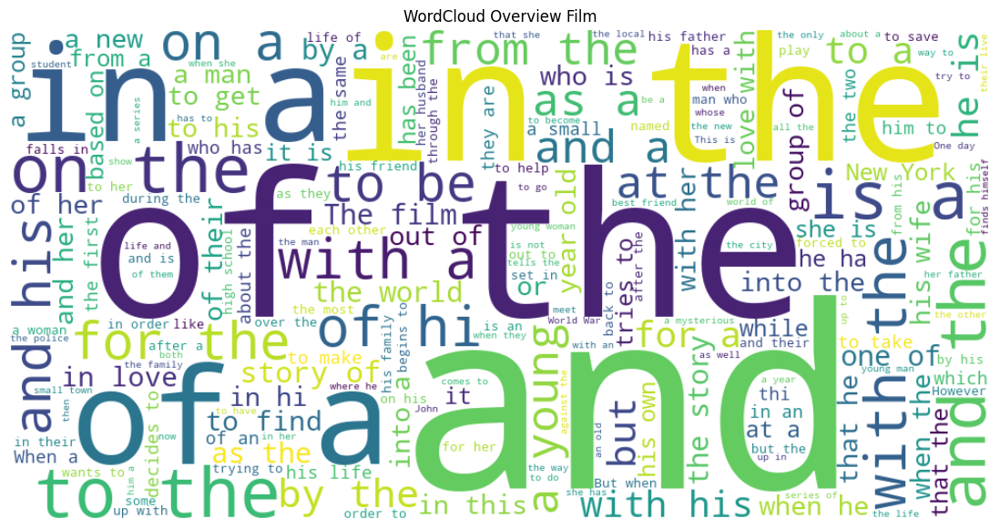

# Laporan Proyek Sistem Rekomendasi - Andi Wibowo

## Project Overview

Sistem rekomendasi film berbasis konten (content-based filtering) merupakan salah satu fitur kunci dalam layanan hiburan digital modern. Sistem ini bekerja dengan menganalisis metadata film seperti genre, overview, serta kredensial kru (misalnya sutradara dan aktor utama) untuk memahami karakteristik film yang disukai pengguna. Dengan membandingkan fitur-fitur tersebut, sistem dapat menyarankan film lain yang memiliki kemiripan dengan film yang sebelumnya pernah ditonton atau disukai pengguna(Salim et al., n.d.).

Penerapan sistem rekomendasi ini memberikan banyak manfaat bagi platform hiburan digital. Rekomendasi film yang relevan dapat meningkatkan kepuasan pengguna karena mereka lebih mudah menemukan film yang sesuai dengan preferensi pribadi tanpa harus mencari secara manual. Selain itu, pengalaman menonton yang lebih personal akan mendorong pengguna untuk menghabiskan waktu lebih lama di platform, sehingga memperpanjang waktu tonton dan meningkatkan loyalitas mereka terhadap layanan yang digunakan(Azri Saputra et al., 2024).

Secara keseluruhan, pengembangan sistem rekomendasi film berbasis konten menjadi sangat penting di tengah persaingan industri hiburan digital yang semakin ketat. Dengan memberikan saran film yang relevan dan personal, platform dapat membedakan diri dari kompetitor, memperkuat hubungan dengan pengguna, serta mendorong eksplorasi konten yang lebih luas. Hal ini tidak hanya menguntungkan pengguna, tetapi juga memberikan nilai tambah bagi industri film secara keseluruhan. 

## Referensi

Azri Saputra, J. M., Huizen, L. M., & Arianto, D. B. (2024). Sistem Rekomendasi Film pada Platform Streaming Menggunakan Metode Content-Based Filtering. Jurnal Transformatika, 22(1), 10. [https://doi.org/10.26623/transformatika.v22i1.7041]

Salim, E., Pragantha, J., & Lauro, M. D. (n.d.). Perancangan Sistem Rekomendasi Film menggunakan metode Content-based Filtering.[https://lintar.untar.ac.id/repository/penelitian/buktipenelitian_10390001_7A281222103549.pdf]

## Business Understanding

### Problem Statements
- Pengguna kesulitan menemukan film yang sesuai preferensi karena banyaknya pilihan tanpa rekomendasi yang relevan.
- Data historis interaksi pengguna tidak selalu tersedia atau lengkap sehingga rekomendasi berbasis pengguna sulit diterapkan.
- Metadata film seperti genre, sinopsis, dan informasi lain belum dimanfaatkan secara optimal untuk sistem rekomendasi.

### Goals
- Membangun sistem rekomendasi berbasis konten yang dapat menyarankan film serupa berdasarkan atribut film tanpa perlu data historis pengguna.
- Menggunakan informasi film seperti genre, sinopsis, dan metadata lainnya untuk menghasilkan rekomendasi yang relevan dan mudah dipahami.
- Memberikan daftar rekomendasi berupa top-N film dengan tingkat kemiripan tertinggi berdasarkan analisis konten film.


## Data Understanding

Dataset yang digunakan terdiri dari dua file utama:
- `movies_metadata.csv`: berisi informasi detail film (judul, sinopsis, genre, tanggal rilis, dll).
- `credits.csv`: berisi informasi pemeran dan kru film.

Sumber: [Kaggle - The Movies Dataset](https://www.kaggle.com/datasets/rounakbanik/the-movies-dataset)

### movies_metadata.csv
Berikut adalah deskripsi dari masing-masing fitur (variabel) dalam dataset:

| **Kolom**               | **Deskripsi**                                                                                                                                                          |
| ----------------------- | ---------------------------------------------------------------------------------------------------------------------------------------------------------------------- |
| `adult`                 | Boolean (`True` / `False`) yang menunjukkan apakah film ini ditujukan untuk penonton dewasa (konten 18+).                                                              |
| `belongs_to_collection` | Informasi apakah film ini merupakan bagian dari koleksi (franchise/serial), seperti "Toy Story Collection". Jika tidak, nilainya `NaN`. Biasanya berbentuk dictionary. |
| `budget`                | Anggaran produksi film dalam **USD**. Tipe data numerik (integer atau float).                                                                                          |
| `genres`                | Daftar genre film dalam bentuk list of dicts (misalnya: `[{'id': 35, 'name': 'Comedy'}]`). Harus diproses untuk digunakan dalam analisis.                              |
| `homepage`              | URL homepage resmi film tersebut, jika tersedia.                                                                                                                       |
| `id`                    | ID film unik dari **TMDB** (The Movie Database). Format numerik, meskipun kadang perlu diproses (ada yang tidak valid atau kosong).                                    |
| `imdb_id`               | ID film versi **IMDb** (misalnya `tt0114709`), bisa digunakan untuk pencocokan lintas platform.                                                                        |
| `original_language`     | Kode bahasa asli film (seperti `en` untuk Inggris, `fr` untuk Prancis).                                                                                                |
| `original_title`        | Judul asli film (bisa berbeda dengan `title` jika film diterjemahkan).                                                                                                 |
| `overview`              | Ringkasan atau deskripsi singkat cerita film. Teks bebas.                                                                                                              |
| `release_date`          | Tanggal rilis film (format `YYYY-MM-DD`).                                                                                                                              |
| `revenue`               | Pendapatan kotor film dalam USD dari seluruh dunia.                                                                                                                    |
| `runtime`               | Durasi film dalam **menit**.                                                                                                                                           |
| `spoken_languages`      | Bahasa yang digunakan dalam film, dalam bentuk list of dicts. Contoh: `[{'iso_639_1': 'en', 'name': 'English'}]`.                                                      |
| `status`                | Status produksi film: contoh umum termasuk `Released`, `Post Production`, `Cancelled`.                                                                                 |
| `tagline`               | Slogan pemasaran film, jika tersedia (contoh: "Roll the dice and unleash the excitement!").                                                                            |
| `title`                 | Judul film versi umum (bisa berbeda dari `original_title`).                                                                                                            |
| `video`                 | Boolean yang menunjukkan apakah ini adalah video digital (`True` / `False`). Biasanya nilainya `False`.                                                                |
| `vote_average`          | Rata-rata skor yang diberikan oleh pengguna TMDB (bernilai dari 0.0 hingga 10.0).                                                                                      |
| `vote_count`            | Jumlah total suara yang diberikan untuk film ini di TMDB. Menunjukkan popularitas.                                                                                     |


DataFrame movies_df terdiri dari 45.466 baris dan 24 kolom. Berdasarkan eksplorasi awal, kolom genres dan overview dapat dimanfaatkan sebagai fitur dalam sistem rekomendasi berbasis konten. Namun, kolom id dalam DataFrame ini masih bertipe string, sehingga perlu dikonversi menjadi integer agar dapat digabungkan dengan DataFrame lain yang memiliki tipe data serupa. Selain itu, kolom genres masih berbentuk JSON dalam format string, sehingga perlu di-parsing menggunakan ast.literal_eval. Kolom overview juga perlu diperhatikan karena masih terdapat beberapa nilai null yang dapat mengganggu proses pembobotan fitur.


### credits.csv
Berikut adalah deskripsi dari masing-masing fitur (variabel) dalam dataset:
| **Kolom** | **Deskripsi**                                                                                                                                                                                                                                                   |
| --------- | --------------------------------------------------------------------------------------------------------------------------------------------------------------------------------------------------------------------------------------------------------------- |
| `cast`    | Informasi tentang para aktor/aktris yang berperan dalam film.          |
| `crew`    | Informasi tentang kru yang bekerja dalam film. |
| `id`      |ID unik untuk setiap film, digunakan sebagai foreign key untuk menggabungkan (merge) dengan DataFrame lain seperti movies_df.  |

DataFrame credits_df terdiri dari 45.476 baris dan 4 kolom, salah satunya adalah kolom cast yang juga potensial digunakan sebagai fitur rekomendasi. Untuk menggunakannya secara efektif, kolom ini perlu di-parsing dari format JSON string ke struktur data Python menggunakan ast.literal_eval. Kolom id dalam credits_df sudah bertipe integer, sehingga dapat digunakan sebagai kunci untuk melakukan penggabungan (merge) dengan movies_df setelah tipe data pada kolom id di movies_df disesuaikan. Dengan persiapan ini, kedua DataFrame dapat digabung dan digunakan untuk membangun sistem rekomendasi yang lebih kaya fitur.


## Exploratory Data Analysis
 
1. Distribusi Genre Filem
  <br>
  <br>Genre yang paling banyak diproduksi adalah Drama, diikuti oleh Comedy, Thriller, dan Romance. Beberapa genre niche seperti Western, War, dan TV Movie hanya memiliki sedikit film. Terdapat label produksi seperti Carousel Productions dalam genre ini bisa jadi kesalahan parsing atau duplikasi kolom saat explode, jadi perlu dibersihkan.

2. Distribusi Panjang Overview
  <br>
  <br>Sebagian besar overview memiliki panjang sekitar 20–40 kata, yang menunjukkan bahwa mayoritas sinopsis film cukup pendek. Terdapat ekor panjang ke kanan (right-skewed), menandakan adanya overview dengan kata yang sangat banyak (hingga >150).

3. WordCloud Overview Filem
  <br>
  <br>Kata-kata yang dominan adalah kata umum dalam bahasa Inggris seperti: "the", "a", "to", "of", "in", dll. Kata kunci kontekstual yang cukup sering muncul: "young", "man", "finds", "story", "life", "family" → menunjukkan tema film umum. Perlu melakukan stopwords removal.

4. 10 Aktor yang paling sering muncul
  <br>
  <br>Aktor-aktor ini menunjukkan produktivitas tinggi dalam jangka waktu panjang, tidak hanya dari satu dekade atau genre saja. Dominasi Gender: Hanya 1 wanita (Bette Davis) dalam 10 besar, mengindikasikan kemungkinan ketimpangan peran utama antara aktor dan aktris dalam industri film pada masa lalu. Keberagaman Asal: Terdapat aktor dari berbagai latar belakang budaya: Amerika (John Wayne, Jackson), Eropa (Depardieu, Mason), Asia (Jackie Chan), menunjukkan jangkauan global industri film.


## Data Preparation

Pada langkah ini melakukan persipan data bersarkan insight yang telah di dapatkan pada data understanding dan EDA.

1.  Melakukan pembersihan data pada kolom 'overview' karena merupakan salah satu fitur yang digunakan pada pemodelan.
```python
movies_df['overview'] = movies_df['overview'].fillna('')
```
 
2. Mengubah type data pada kolom id yang sebelumnya masih bertype object diubah menjadi int.
```python
movies_df['id'] = pd.to_numeric(movies_df['id'], errors='coerce')
movies_df = movies_df.dropna(subset=['id'])
movies_df['id'] = movies_df['id'].astype(int)
```
Mengubah tipe data kolom id dari object (string) menjadi int penting dilakukan untuk memastikan kesesuaian dan keberhasilan dalam proses penggabungan (merge) antar DataFrame — khususnya antara movies_df dan credits_df.

3. Penanganan label tidak relevan pada kolom genres
<br>
Penanganan label tidak relevan pada kolom genres terjadi karena data korup, kemungkinan karena baris-baris tersebut berasal dari entri dengan `id` yang tidak valid.  Baris-baris tersebut telah dihapus saat proses konversi `id` ke integer.

4. Menggabungkan 2 Data Frame berdasarkan Id.  
```python
credits_df['id'] = credits_df['id'].astype(int)
movies_df['id'] = movies_df['id'].astype(int)
credits_clean = credits_df[['id', 'main_cast']]
df = movies_df.merge(credits_clean, on='id')
```
Hal ini dilakukan agar kita dapat menggunakan fitur genres, overview (yang berasal dari movies_df), serta main_cast (yang berasal dari credits_df) dalam satu DataFrame untuk keperluan pemodelan sistem rekomendasi.

5. Melakukan pemilihan subset data dengan mengambil 20.000 baris pertama dari dataset utama.
```python
df_subset = df.head(20000)
```
Pemilihan ini bertujuan untuk:
  <br> 1. Mengurangi beban komputasi dan penggunaan memori agar proses perhitungan similarity dapat berjalan lebih efisien di lingkungan lokal. 
  2. Memastikan proses pengujian dan pengembangan model rekomendasi dapat dilakukan secara praktis dan cepat.
  3. Tetap menjaga representasi data yang cukup besar sehingga model tetap mampu menghasilkan rekomendasi yang relevan.

6. Menggabungkan fitur genres, overview, dan main_cast ke dalam satu kolom teks gabungan yang disebut soup.
```python
def clean_data(x):
    if isinstance(x, list):
        return ' '.join(x)
    elif isinstance(x, str):
        return x
    else:
        return ''
    
df_subset['soup'] = df_subset['genres'].apply(clean_data) + ' ' + \
                    df_subset['main_cast'].apply(clean_data) + ' ' + \
                    df_subset['overview']
```
Kolom soup ini akan digunakan sebagai dasar dalam pemodelan content-based filtering, karena mengandung informasi gabungan dari genre film, deskripsi singkat (overview), dan pemeran utama.

7. Mengubah teks gabungan dalam kolom soup menjadi representasi numerik menggunakan TF-IDF (Term Frequency-Inverse Document Frequency).
```python
tfidf = TfidfVectorizer(stop_words='english')
tfidf_matrix = tfidf.fit_transform(df_subset['soup'])
print("TF-IDF matrix shape:", tfidf_matrix.shape)
```
Langkah ini bertujuan untuk menghitung bobot setiap kata dalam soup, agar sistem dapat mengenali seberapa penting suatu kata dalam sebuah film dibandingkan dengan seluruh koleksi film lainnya.

## Modeling and Result
Implementasi perhitungan cosine similarity dilakukan menggunakan fungsi linear_kernel dari pustaka scikit-learn. Fungsi ini secara efisien menghitung dot product antar vektor TF-IDF, yang mana karena vektor-vektor tersebut sudah ternormalisasi, dot product tersebut setara dengan nilai cosine similarity. Nilai cosine similarity mengukur tingkat kemiripan antara dua film berdasarkan representasi teks gabungan yang terdiri dari fitur genre, overview, dan pemeran utama.

Kode berikut menghitung matriks cosine similarity untuk seluruh film dalam dataset:
```python
cosine_sim = linear_kernel(tfidf_matrix, tfidf_matrix)
print("Cosine similarity matrix shape:", cosine_sim.shape)
print("Similarity film index 0 dengan film lain:", cosine_sim[0][:10])
```
Setelah membangun matriks cosine similarity dari fitur gabungan seperti genre, pemeran utama, dan sinopsis, kita dapat memilih 10 film yang paling mirip dengan film pada indeks tertentu (misalnya indeks 0). Proses ini dilakukan dengan mengurutkan skor cosine similarity secara menurun dan mengambil film-film dengan skor tertinggi selain film itu sendiri.
```python
index_film = 0
sim_scores = list(enumerate(cosine_sim[index_film]))

sim_scores = sorted(sim_scores, key=lambda x: x[1], reverse=True)
top_similar = sim_scores[1:11]

for i, score in top_similar:
print(f"{movies_df['title'][i]} (Similarity Score: {score:.4f})")
```
Sebagai contoh, dengan film pada indeks 0 sebagai input, didapat daftar 10 film teratas yang paling mirip berdasarkan kemiripan konten, yaitu:

Once Upon A Time in Phuket (Similarity Score: 0.1677)

Cargo 200 (Similarity Score: 0.1616)

Caged Heat (Similarity Score: 0.1605)

The Mummy's Ghost (Similarity Score: 0.1465)

She-Wolf of London (Similarity Score: 0.1455)

Jumanji (Similarity Score: 0.1380)

Who Dares Wins (Similarity Score: 0.1136)

Cimarron (Similarity Score: 0.1126)

High Anxiety (Similarity Score: 0.1022)

Eastern Plays (Similarity Score: 0.1007)

Skor kemiripan ini menunjukkan tingkat kedekatan konten antar film, di mana nilai yang lebih tinggi berarti kemiripan yang lebih besar.

Untuk memudahkan pengguna, dibuat fungsi get_recommendations() yang menerima input judul film, lalu mencari indeks film tersebut di dataset. Fungsi ini mengambil skor cosine similarity terhadap seluruh film lain dan mengembalikan daftar 10 film yang paling relevan berdasarkan konten.

Sebagai contoh, saat fungsi dijalankan dengan input film tertentu, sistem merekomendasikan film-film yang secara konten mirip dengan input tersebut. Rekomendasi ini membantu pengguna menemukan pilihan tontonan baru yang sesuai preferensi mereka, tanpa perlu data riwayat aktivitas pengguna, hanya berdasarkan kesamaan fitur film.
## Evaluation

Evaluasi performa sistem rekomendasi dilakukan dengan dua pendekatan: kualitatif dan kuantitatif.

### Evaluasi Kualitatif
Pada evaluasi kualitatif, dilakukan pemeriksaan manual dengan memilih beberapa film populer sebagai contoh uji. Tujuannya adalah untuk melihat apakah sistem mampu memberikan rekomendasi yang relevan dan tematis berdasarkan kemiripan fitur seperti genre, pemeran, dan overview film.

Sebagai contoh, untuk film "The Dark Knight", sistem merekomendasikan film-film seperti Down Argentine Way dengan genre Comedy, Drama, Music, Romance, Supermen of Malegaon yang merupakan Documentary, Street Without End bergenre Drama, Fun Is Beautiful (Comedy), dan Big Nothing dengan genre Action, Comedy, Crime, Thriller. Selain itu ada juga rekomendasi film yang mungkin kurang ber-genre jelas seperti No Exit, serta film-film lain dengan genre Drama, Romance, Adventure, Crime, hingga Horror.

Begitu pula untuk film "The Dark Knight Rises", sistem menghasilkan daftar rekomendasi film dengan genre yang beragam namun masih relevan secara tematik. Beberapa film yang direkomendasikan adalah The Lone Ranger and the Lost City of Gold dengan genre Action, Adventure, Western; The Bridge of San Luis Rey bergenre Romance dan Drama; Once Upon a Time in the Midlands yang merupakan gabungan genre Action, Comedy, Drama, dan Romance; serta Rampage (Action, Drama, Crime, Thriller) dan Sucker Punch (Action, Fantasy, Thriller). Ada juga film-film seperti Billabong Odyssey (Action, Adventure, Documentary), Prisoners of the Lost Universe (Adventure, Science Fiction, Action), dan lainnya.

Hasil ini menunjukkan bahwa meskipun rekomendasi memiliki variasi genre yang cukup luas, sistem masih mampu menangkap kemiripan konten secara tematik. Dengan demikian, sistem rekomendasi dapat memberikan pilihan film yang relevan dan berpotensi menarik bagi pengguna berdasarkan kesamaan fitur konten film.

### Evaluasi Kuantitatif

Untuk mengukur performa sistem secara objektif, digunakan metrik evaluasi kuantitatif berupa Confusion Matrix, Precision, dan Recall. Metrik ini menghitung seberapa baik sistem dalam merekomendasikan film yang benar-benar relevan berdasarkan ground truth yang telah ditentukan.
Berikut hasil evaluasinya:

Confusion Matrix 
<br>
Precision: 0.50
Recall: 0.67

Precision 0.50 menunjukkan bahwa dari semua film yang direkomendasikan sebagai relevan, 50% benar-benar sesuai dengan harapan atau ground truth.

Recall 0.67 menunjukkan bahwa sistem mampu menemukan 67% dari seluruh film relevan yang seharusnya direkomendasikan.

Secara keseluruhan, hasil ini mengindikasikan sistem memiliki kemampuan yang cukup baik dalam merekomendasikan film yang relevan, meskipun masih ada ruang untuk perbaikan terutama dalam meningkatkan precision agar rekomendasi yang diberikan lebih akurat dan minim film yang kurang relevan.
